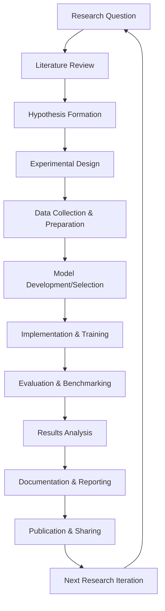
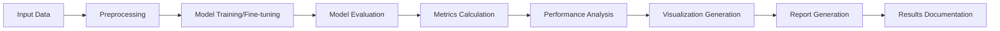

# AI Engineering & Systems Development Research Project

## Project Overview

This repository contains a comprehensive collection of research projects focused on **AI Engineering** and **Systems Development with AI**. The primary objective is to explore, evaluate, and implement cutting-edge artificial intelligence techniques for practical software engineering applications, with particular emphasis on model fine-tuning, performance benchmarking, and real-world system integration.

## 🎯 Research Objectives

### Primary Goals
- **Model Fine-tuning Research**: Investigate and implement fine-tuning techniques for large language models
- **Performance Benchmarking**: Develop comprehensive evaluation frameworks for AI model performance assessment
- **Domain-Specific Applications**: Apply AI techniques to specialized domains (healthcare, software engineering, etc.)
- **System Integration**: Build practical AI-powered systems for real-world applications
- **Academic Research**: Contribute to the growing body of knowledge in AI engineering and software development

### Research Focus Areas
1. **Natural Language Processing (NLP)**
2. **Software Requirements Engineering**
3. **Model Performance Evaluation**
4. **Domain Adaptation Techniques**
5. **AI System Architecture Design**

## 📁 Project Structure

```
projects/
├── README.md                           # This file - Project overview and documentation
├── fine_tunning/                       # Project 1: GPT-4.1-Nano Fine-tuning & Benchmarking
│   ├── data/                          # Training and test datasets
│   │   ├── dataset-train.jsonl        # Training data (81 examples)
│   │   ├── dataset-test.jsonl         # Original test data (27 examples)
│   │   ├── dataset.jsonl              # Additional test data
│   │   ├── dataset-test2.xlsx         # Excel test data
│   │   └── merged_test_dataset.jsonl  # Merged test dataset (150 examples)
│   ├── image/                         # Performance visualizations and charts
│   │   ├── model_comparison.png       # Comprehensive model comparison
│   │   ├── improvement_analysis.png   # Performance improvement analysis
│   │   ├── confusion_matrix_*.png     # Confusion matrices for both models
│   │   └── performance_*.png          # Individual model performance charts
│   ├── scripts/                       # Evaluation and analysis scripts
│   │   ├── test_base_model.py         # Base model evaluation
│   │   ├── test_finetuned_model.py    # Fine-tuned model evaluation
│   │   ├── compare_models.py          # Model comparison analysis
│   │   ├── convert_excel_to_jsonl.py  # Data conversion utilities
│   │   └── merge_datasets.py          # Dataset merging utilities
│   ├── README.md                      # Project-specific documentation
│   ├── REPORT.md                      # Comprehensive technical report
│   ├── requirements.txt               # Python dependencies
│   └── run_evaluation.py              # Main orchestration script
├── [future_projects]/                 # Additional AI engineering projects
│   ├── project_2/                     # Next research project
│   ├── project_3/                     # Future research project
│   └── ...
└── docs/                              # Global documentation and resources
    ├── methodology/                   # Research methodology guidelines
    ├── templates/                     # Project templates and standards
    └── resources/                     # Shared resources and utilities
```

## 🔬 Research Methodology

### Project Development Lifecycle



### Evaluation Framework



## 🚀 Current Projects

### Project 1: GPT-4.1-Nano Fine-tuning & Performance Benchmarking

**Status**: ✅ Completed  
**Domain**: Software Requirements Classification  
**Model**: GPT-4.1-Nano (Base) → Fine-tuned Model  

#### Key Achievements
- **+17.41% accuracy improvement** through fine-tuning
- **+56.94% improvement** in functional requirement recall
- **+51.07% improvement** in non-functional requirement precision
- Comprehensive evaluation framework with 150 test examples
- Detailed performance analysis and visualization

#### Technical Specifications
- **Training Data**: 81 healthcare/EHR software requirements
- **Test Data**: 150 examples from multiple sources
- **Fine-tuned Model ID**: `ft:gpt-4.1-nano-2025-04-14:rondon:viniciusrondon:CBQ8G05I`
- **Evaluation Metrics**: Accuracy, Precision, Recall, F1-Score, Confusion Matrix

#### Results Summary
| Metric | Base Model | Fine-tuned Model | Improvement |
|--------|------------|------------------|-------------|
| **Accuracy** | 59.26% | 76.67% | **+17.41%** |
| **Precision (Functional)** | 87.50% | 60.47% | -27.03% |
| **Recall (Functional)** | 41.18% | 98.11% | **+56.94%** |
| **Precision (Non-functional)** | 47.37% | 98.44% | **+51.07%** |
| **Recall (Non-functional)** | 90.00% | 64.95% | -25.05% |

## 🔧 Technical Infrastructure

### Development Environment
- **Python**: 3.8+
- **AI/ML Libraries**: OpenAI API, scikit-learn, pandas, matplotlib, seaborn
- **Data Processing**: JSONL, Excel, CSV support
- **Visualization**: Matplotlib, Seaborn for performance charts
- **Documentation**: Markdown with Mermaid diagrams

### Quality Assurance
- **Code Standards**: PEP 8 compliance, type hints, docstrings
- **Testing**: Unit tests, integration tests, performance benchmarks
- **Documentation**: Comprehensive README files, technical reports
- **Version Control**: Git with conventional commit messages
- **Reproducibility**: Fixed random seeds, dependency management

## 📊 Research Impact & Applications

### Academic Contributions
- **Methodology**: Comprehensive fine-tuning evaluation framework
- **Benchmarking**: Standardized performance assessment protocols
- **Domain Adaptation**: Healthcare/EHR requirements classification insights
- **Reproducibility**: Open-source implementation with detailed documentation

### Practical Applications
- **Software Engineering**: Automated requirements classification
- **Quality Assurance**: Improved system design and architecture decisions
- **Healthcare Technology**: EHR system requirements analysis
- **AI System Development**: Model fine-tuning best practices

## 🎓 Educational Value

### Learning Outcomes
- **AI Engineering**: Hands-on experience with model fine-tuning
- **Performance Evaluation**: Comprehensive benchmarking methodologies
- **Research Methodology**: Academic research and documentation practices
- **Software Development**: Full-stack AI system development
- **Data Science**: Data processing, analysis, and visualization

### Skills Developed
- **Technical Skills**: Python, AI/ML, data analysis, visualization
- **Research Skills**: Literature review, experimental design, statistical analysis
- **Communication Skills**: Technical writing, presentation, documentation
- **Project Management**: Planning, execution, quality assurance

## 🔮 Future Research Directions

### Planned Projects
1. **Multi-domain Requirements Classification**: Extend to finance, e-commerce, etc.
2. **Hierarchical Requirements Analysis**: Support for subcategories and relationships
3. **Real-time Requirements Processing**: Live analysis of requirements documents
4. **Integration with Development Tools**: Jira, Confluence, GitHub integration
5. **Cross-lingual Requirements Analysis**: Support for multiple languages

### Research Opportunities
- **Active Learning**: Iterative improvement with human feedback
- **Ensemble Methods**: Combining multiple models for better performance
- **Transfer Learning**: Cross-domain knowledge transfer techniques
- **Explainable AI**: Interpretable requirements classification
- **Scalability Studies**: Performance on large-scale requirements datasets

## 📚 Documentation & Resources

### Project Documentation
- **Technical Reports**: Comprehensive analysis and results
- **Code Documentation**: Inline comments, docstrings, README files
- **Visualization**: Performance charts, confusion matrices, improvement analysis
- **Methodology**: Detailed experimental design and evaluation protocols

### External Resources
- **Academic Papers**: Relevant research literature
- **Datasets**: Publicly available requirements datasets
- **Tools & Libraries**: AI/ML frameworks and utilities
- **Best Practices**: Industry standards and guidelines

## 🤝 Contributing & Collaboration

### How to Contribute
1. **Fork the Repository**: Create your own copy
2. **Create Feature Branch**: Work on specific improvements
3. **Follow Standards**: Adhere to coding and documentation standards
4. **Submit Pull Request**: Propose changes with detailed description
5. **Code Review**: Participate in peer review process

### Collaboration Guidelines
- **Communication**: Clear, professional, and respectful
- **Documentation**: Comprehensive and up-to-date
- **Testing**: Thorough testing before submission
- **Quality**: High standards for code and research quality

## 📄 License & Citation

### License
This project is licensed under the MIT License - see the LICENSE file for details.

### Citation
If you use this research in your work, please cite:

```bibtex
@misc{ai_engineering_research_2025,
  title={AI Engineering & Systems Development Research Project},
  author={[Your Name]},
  year={2025},
  url={https://github.com/viniciusrondon/AI-Engineering-Systems-Development-Research-Project.git}
}
```

## 📞 Contact & Support

### Project Maintainer
- **Name**: Vinicius Rondon
- **Email**: vinicius.rondon.102155@ga.ita.br
- **LinkedIn**: https://www.linkedin.com/in/vinicius-rondon-8a4639272/
- **GitHub**: https://github.com/viniciusrondon

### Support
- **Issues**: Use GitHub Issues for bug reports and feature requests
- **Discussions**: Use GitHub Discussions for questions and collaboration
- **Documentation**: Check project README files for detailed information

---

## 🏆 Project Status

| Project | Status | Completion | Last Updated |
|---------|--------|------------|--------------|
| GPT-4.1-Nano Fine-tuning | ✅ Completed | 100% | 2025-09-02 |


---

**Last Updated**: September 2, 2025  
**Version**: 1.0.0  
**Maintainer**: Vinicius Rondon

*This repository represents ongoing research in AI Engineering and Systems Development. Contributions, feedback, and collaboration are welcome.*
