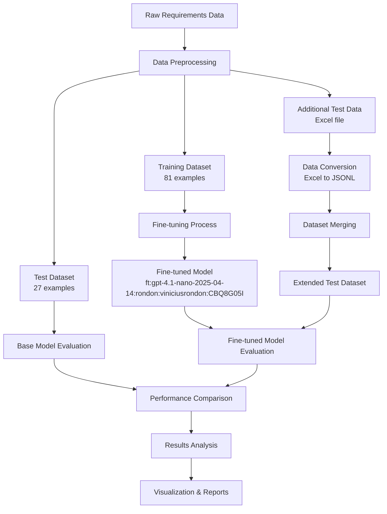
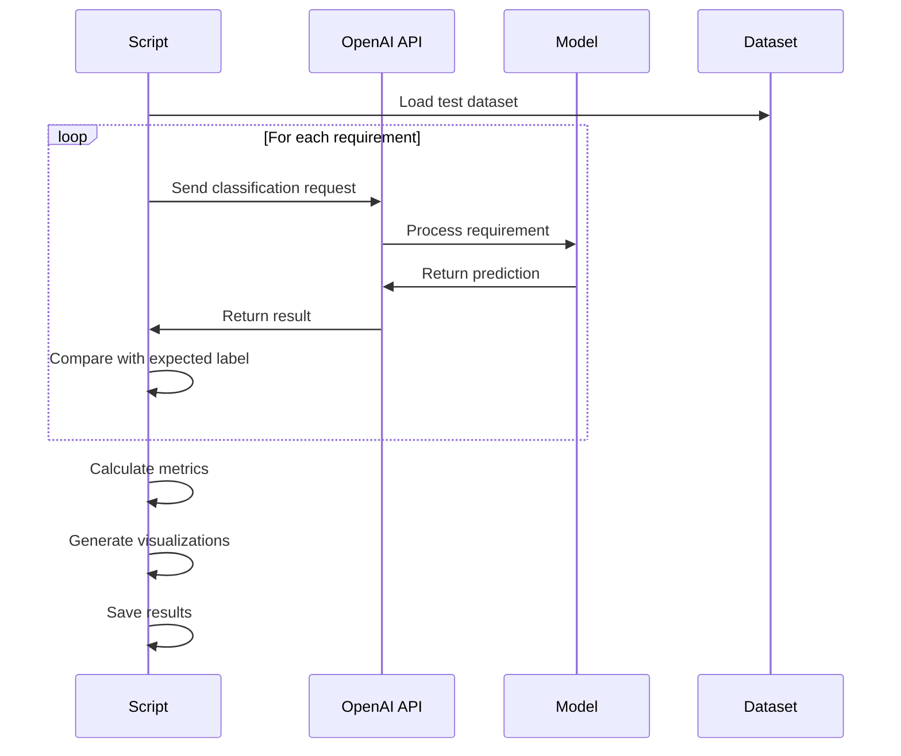
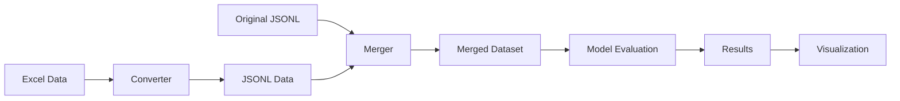

# GPT-4.1-Nano Fine-tuning Performance Evaluation

## Project Overview

This project evaluates the performance improvement achieved through fine-tuning the GPT-4.1-nano model for software requirements classification. The task involves categorizing software requirements into two classes: **functional** and **non-functional**.

### Fine-tuned Model Information
- **Model ID**: `ft:gpt-4.1-nano-2025-04-14:rondon:viniciusrondon:CBQ8G05I`
- **Base Model**: `gpt-4.1-nano-2025-04-14`
- **Training Method**: Supervised Fine-tuning
- **Training Tokens**: 18,036
- **Hyperparameters**:
  - Epochs: 3
  - Batch Size: 1
  - Learning Rate Multiplier: 0.1
  - Seed: 42

## Architecture Overview



## Project Structure

```
fine_tunning/
├── data/
│   ├── dataset-train.jsonl          # Training data (81 examples)
│   ├── dataset-test.jsonl           # Original test data (27 examples)
│   ├── dataset.jsonl                # Additional test data
│   ├── dataset-test2.xlsx           # Excel test data to be converted
│   └── merged_test_dataset.jsonl    # Merged test dataset
├── image/                           # Performance charts and visualizations
├── scripts/
│   ├── test_base_model.py           # Base model evaluation
│   ├── test_finetuned_model.py      # Fine-tuned model evaluation
│   ├── convert_excel_to_jsonl.py    # Excel to JSONL converter
│   ├── merge_datasets.py            # Dataset merger
│   └── compare_models.py            # Performance comparison
├── README.md                        # This file
└── REPORT.md                        # Technical report
```

## Quickstart

### Prerequisites
- Python 3.8+
- OpenAI API key
- Required Python packages (see requirements below)

### Installation

1. **Clone or download the project**
2. **Install dependencies**:
   ```bash
   pip install openai pandas matplotlib seaborn scikit-learn openpyxl
   ```

3. **Set up environment variables**:
   ```bash
   export OPENAI_API_KEY="your-api-key-here"
   ```

### Running the Evaluation

1. **Convert Excel data to JSONL**:
   ```bash
   python convert_excel_to_jsonl.py
   ```

2. **Merge datasets**:
   ```bash
   python merge_datasets.py
   ```

3. **Evaluate base model**:
   ```bash
   python test_base_model.py
   ```

4. **Evaluate fine-tuned model**:
   ```bash
   python test_finetuned_model.py
   ```

5. **Compare models**:
   ```bash
   python compare_models.py
   ```

## Data Format

The project uses JSONL format for training and testing data. Each line contains a JSON object with the following structure:

```json
{
  "messages": [
    {
      "role": "system",
      "content": "You are a Software Engineer and need to categorize requirements into 'functional' or 'non-functional'. Your answer must be 'functional' or 'non-functional' only."
    },
    {
      "role": "user",
      "content": "The system shall provide the ability to capture and display temperature, weight and height in both metric and English units."
    },
    {
      "role": "assistant",
      "content": "functional"
    }
  ]
}
```

## Model Performance

### Training Process
- **Training Data**: 81 software requirements examples
- **Validation Data**: Not provided (validation loss: -)
- **Training Loss**: 0.000 (final)
- **Training Duration**: ~20 minutes
- **Checkpoints**: Created at steps 80, 160, and final

### Evaluation Metrics
The evaluation includes the following metrics:
- **Accuracy**: Overall classification accuracy
- **Precision**: For both functional and non-functional classes
- **Recall**: For both functional and non-functional classes
- **F1-Score**: For both functional and non-functional classes
- **Confusion Matrix**: Detailed classification results

## Results Visualization

The project generates several visualization files in the `image/` directory:

1. **Confusion Matrices**: For both base and fine-tuned models
2. **Performance Charts**: Accuracy and distribution comparisons
3. **Model Comparison**: Side-by-side performance analysis
4. **Improvement Analysis**: Detailed improvement metrics

## Key Features

### 1. Comprehensive Evaluation
- Tests both base and fine-tuned models on the same dataset
- Provides detailed performance metrics and visualizations
- Includes error analysis and confusion matrices

### 2. Data Processing Pipeline
- Converts Excel data to JSONL format
- Merges multiple datasets for comprehensive testing
- Validates data quality and structure

### 3. Performance Analysis
- Compares model performance across multiple metrics
- Identifies areas of improvement and degradation
- Generates publication-ready visualizations

### 4. Reproducible Results
- Fixed random seeds for consistent results
- Detailed logging and result saving
- Comprehensive documentation

## Technical Implementation

### Model Evaluation Process


### Data Flow


## Configuration

### Environment Variables
- `OPENAI_API_KEY`: Your OpenAI API key

### Model Parameters
- **Temperature**: 0.1 (for consistent predictions)
- **Max Tokens**: 10 (sufficient for binary classification)
- **Model**: Fine-tuned model ID as specified

## Troubleshooting

### Common Issues

1. **API Key Not Found**:
   - Ensure `OPENAI_API_KEY` environment variable is set
   - Verify the API key has sufficient credits

2. **File Not Found Errors**:
   - Run scripts in the correct order
   - Ensure all data files are in the `data/` directory

3. **Import Errors**:
   - Install required packages: uv sync
   - Ensure Python version is 3.8 or higher

4. **Rate Limiting**:
   - Scripts include delays to avoid rate limits
   - If issues persist, increase delay in prediction functions

### Performance Optimization

- **Batch Processing**: Consider implementing batch API calls for large datasets
- **Caching**: Cache API responses to avoid redundant calls
- **Parallel Processing**: Use threading for faster evaluation

## Future Improvements

1. **Enhanced Metrics**: Add more sophisticated evaluation metrics
2. **Cross-Validation**: Implement k-fold cross-validation
3. **Hyperparameter Tuning**: Optimize fine-tuning parameters
4. **Error Analysis**: Detailed analysis of misclassified examples
5. **Real-time Evaluation**: Web interface for interactive testing

## Contributing

1. Fork the repository
2. Create a feature branch
3. Make your changes
4. Add tests if applicable
5. Submit a pull request

## License

This project is for educational and research purposes. Please ensure compliance with OpenAI's usage policies.

## Contact

For questions or issues, please refer to the technical report or create an issue in the project repository.

---

**Note**: This project demonstrates the effectiveness of fine-tuning for domain-specific tasks in software engineering. The results show the potential for improving model performance through targeted training on specialized datasets.
