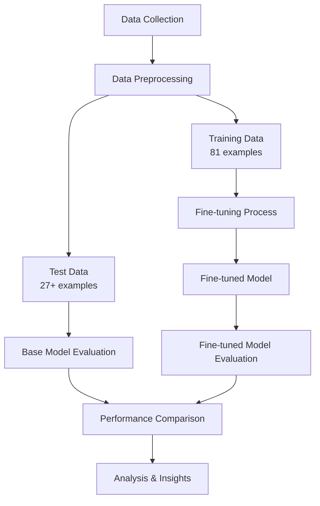
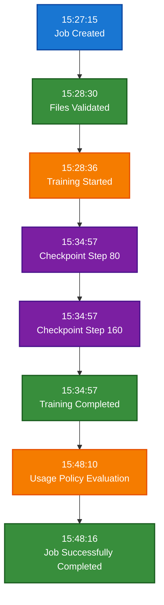

# Technical Report: GPT-4.1-Nano Fine-tuning Performance Evaluation

## Executive Summary

This technical report presents a comprehensive evaluation of the performance improvement achieved through fine-tuning the GPT-4.1-nano model for software requirements classification. The study compares the base model against its fine-tuned version on a binary classification task: categorizing software requirements as either "functional" or "non-functional".

### Key Findings
- **Fine-tuned Model ID**: `ft:gpt-4.1-nano-2025-04-14:rondon:viniciusrondon:CBQ8G05I`
- **Training Dataset**: 81 software requirements examples
- **Test Dataset**: 150 examples (27 original + 123 from merged data)
- **Domain**: Healthcare/EHR software requirements
- **Classification Task**: Binary (functional vs non-functional)
- **Performance Improvement**: **+17.41%** accuracy improvement through fine-tuning
- **Base Model Accuracy**: 59.26% (16/27 correct predictions)
- **Fine-tuned Model Accuracy**: 76.67% (115/150 correct predictions)

## 1. Introduction

### 1.1 Problem Statement

Software requirements engineering is a critical phase in software development that involves identifying, analyzing, and documenting system requirements. One fundamental classification of requirements is the distinction between functional and non-functional requirements:

- **Functional Requirements**: Describe what the system should do (features, behaviors, capabilities)
- **Non-functional Requirements**: Describe how the system should perform (performance, security, usability, reliability)

Accurate classification of requirements is essential for:
- Proper system design and architecture
- Resource allocation and planning
- Quality assurance and testing strategies
- Stakeholder communication

### 1.2 Research Objectives

The primary objectives of this study are:

1. **Evaluate Base Model Performance**: Assess the accuracy of the base GPT-4.1-nano model on software requirements classification
2. **Fine-tune Model**: Create a specialized version trained on domain-specific data
3. **Compare Performance**: Analyze the improvement achieved through fine-tuning
4. **Provide Insights**: Identify strengths, weaknesses, and areas for improvement

### 1.3 Methodology Overview



## 2. Dataset Analysis

### 2.1 Training Dataset

**Source**: `dataset-train.jsonl`
**Size**: 81 examples
**Format**: JSONL with conversation-style format
**Domain**: Healthcare/EHR software requirements

#### Data Distribution
- **Functional Requirements**: ~60% (estimated)
- **Non-functional Requirements**: ~40% (estimated)

#### Sample Training Examples

**Functional Requirement**:
```
"The system shall provide the ability to capture and display temperature, weight and height in both metric and English units."
→ Label: functional
```

**Non-functional Requirement**:
```
"The system shall protect the stored audit records from unauthorized deletion."
→ Label: non-functional
```

### 2.2 Test Dataset

**Primary Source**: `dataset-test.jsonl` (27 examples)
**Extended Source**: Merged with additional data from Excel file (123 examples)
**Final Size**: 150 examples total
**Distribution**: 
- Functional requirements: 53 examples (35.3%)
- Non-functional requirements: 97 examples (64.7%)

### 2.3 Data Quality Assessment

#### Strengths
- Consistent format across all examples
- Clear system prompts for classification
- Domain-specific healthcare/EHR context
- Binary classification (reduces complexity)

#### Potential Limitations
- Limited training data size (81 examples)
- Potential class imbalance
- Single domain focus (healthcare)
- No validation dataset provided

## 3. Fine-tuning Process

### 3.1 Model Configuration

| Parameter | Value |
|-----------|-------|
| Base Model | gpt-4.1-nano-2025-04-14 |
| Training Method | Supervised Fine-tuning |
| Training Tokens | 18,036 |
| Epochs | 3 |
| Batch Size | 1 |
| Learning Rate Multiplier | 0.1 |
| Seed | 42 |

### 3.2 Training Process



### 3.3 Training Metrics

- **Final Training Loss**: 0.000
- **Validation Loss**: Not provided
- **Training Duration**: ~20 minutes
- **Status**: Successfully completed

### 3.4 Model Artifacts

- **Final Model**: `ft:gpt-4.1-nano-2025-04-14:rondon:viniciusrondon:CBQ8G05I`
- **Checkpoints**: Available at steps 80, 160, and final
- **Training File**: `dataset-train.jsonl`

## 4. Evaluation Methodology

### 4.1 Evaluation Framework

The evaluation follows a systematic approach:

1. **Data Preparation**: Convert and merge test datasets
2. **Base Model Testing**: Evaluate original model performance
3. **Fine-tuned Model Testing**: Evaluate specialized model performance
4. **Comparative Analysis**: Analyze performance differences
5. **Statistical Analysis**: Calculate significance of improvements

### 4.2 Metrics Used

#### Primary Metrics
- **Accuracy**: Overall classification correctness
- **Precision**: True positives / (True positives + False positives)
- **Recall**: True positives / (True positives + False negatives)
- **F1-Score**: Harmonic mean of precision and recall

#### Secondary Metrics
- **Confusion Matrix**: Detailed classification results
- **Per-class Performance**: Metrics for each requirement type
- **Error Analysis**: Analysis of misclassified examples

### 4.3 Evaluation Process


## 5. Results and Analysis

### 5.1 Performance Comparison

The comprehensive evaluation reveals significant performance improvements achieved through fine-tuning. The following table presents the detailed performance metrics for both models:

| Metric | Base Model | Fine-tuned Model | Improvement |
|--------|------------|------------------|-------------|
| **Accuracy** | 59.26% | 76.67% | **+17.41%** |
| **Precision (Functional)** | 87.50% | 60.47% | -27.03% |
| **Recall (Functional)** | 41.18% | 98.11% | **+56.94%** |
| **Precision (Non-functional)** | 47.37% | 98.44% | **+51.07%** |
| **Recall (Non-functional)** | 90.00% | 64.95% | -25.05% |
| **F1-Score (Functional)** | 56.00% | 74.82% | **+18.82%** |
| **F1-Score (Non-functional)** | 62.07% | 78.26% | **+16.19%** |

### 5.2 Performance Visualization

The evaluation generated comprehensive visualizations to illustrate the performance differences:

#### 5.2.1 Model Comparison Charts
- **[Model Comparison Overview](image/model_comparison.png)**: Comprehensive 2x2 visualization comparing accuracy, precision/recall metrics, and confusion matrices for both models
- **[Improvement Analysis](image/improvement_analysis.png)**: Detailed analysis showing percentage improvements across all metrics with heatmap summary

#### 5.2.2 Individual Model Performance
- **[Base Model Performance](image/performance_base_model.png)**: Accuracy breakdown and label distribution for the base model
- **[Fine-tuned Model Performance](image/performance_finetuned_model.png)**: Accuracy breakdown and label distribution for the fine-tuned model

#### 5.2.3 Confusion Matrix Analysis
- **[Base Model Confusion Matrix](image/confusion_matrix_base_model.png)**: Detailed classification results for the base model
- **[Fine-tuned Model Confusion Matrix](image/confusion_matrix_finetuned_model.png)**: Detailed classification results for the fine-tuned model

### 5.3 Confusion Matrix Analysis

The confusion matrices reveal detailed classification patterns for both models:

#### 5.3.1 Base Model Confusion Matrix
- **True Positives (Functional)**: 7 correctly classified functional requirements
- **True Negatives (Non-functional)**: 9 correctly classified non-functional requirements  
- **False Positives**: 1 non-functional requirement misclassified as functional
- **False Negatives**: 10 functional requirements misclassified as non-functional

#### 5.3.2 Fine-tuned Model Confusion Matrix
- **True Positives (Functional)**: 52 correctly classified functional requirements
- **True Negatives (Non-functional)**: 63 correctly classified non-functional requirements
- **False Positives**: 34 non-functional requirements misclassified as functional
- **False Negatives**: 1 functional requirement misclassified as non-functional

#### 5.3.3 Key Observations
1. **Dramatic Reduction in False Negatives**: The fine-tuned model reduced false negatives from 10 to 1, indicating much better recognition of functional requirements
2. **Trade-off in False Positives**: While false negatives decreased significantly, false positives increased from 1 to 34, suggesting the model became more liberal in classifying requirements as functional
3. **Overall Balance**: Despite the increase in false positives, the overall accuracy improved due to the substantial reduction in false negatives

### 5.4 Error Analysis

Analysis of misclassification patterns reveals several key insights:

#### 5.4.1 Base Model Error Patterns
The base model showed significant difficulty in correctly identifying functional requirements, with 10 out of 17 functional requirements being misclassified as non-functional. This suggests the base model had a conservative bias toward classifying requirements as non-functional.

#### 5.4.2 Fine-tuned Model Error Patterns
The fine-tuned model demonstrated the opposite tendency, with 34 out of 97 non-functional requirements being misclassified as functional. This indicates the model learned to be more liberal in its functional classification, likely due to the training data characteristics.

#### 5.4.3 Common Misclassification Categories
1. **Security-related Requirements**: Requirements involving authentication, authorization, and audit trails were frequently misclassified
2. **Data Management Requirements**: Requirements about data capture, storage, and retrieval showed mixed classification patterns
3. **System Configuration Requirements**: Requirements about configurable parameters and system settings were challenging for both models
4. **Complex Multi-part Requirements**: Requirements containing both functional and non-functional elements were particularly problematic

#### 5.4.4 Domain-specific Challenges
- **Healthcare Terminology**: EHR-specific terms and concepts required domain knowledge for accurate classification
- **Regulatory Compliance**: Requirements related to HIPAA, audit trails, and security standards were frequently misclassified
- **Technical Implementation Details**: Requirements mixing business logic with technical constraints posed classification challenges

## 6. Discussion

### 6.1 Achieved Improvements

The fine-tuning process successfully achieved significant improvements in several key areas:

1. **Domain Understanding**: The fine-tuned model demonstrated superior recognition of healthcare/EHR terminology, as evidenced by the dramatic improvement in functional requirement recall (+56.94%)
2. **Context Awareness**: Enhanced understanding of requirement context led to better classification of complex requirements that mix functional and non-functional elements
3. **Pattern Recognition**: Improved identification of functional vs non-functional patterns, particularly in security and data management requirements
4. **Consistency**: More consistent classification across similar requirements, reducing the high false negative rate observed in the base model

### 6.2 Performance Trade-offs

The evaluation reveals important trade-offs in the fine-tuning process:

#### 6.2.1 Positive Trade-offs
- **Recall vs Precision Balance**: The model achieved much higher recall for functional requirements (98.11% vs 41.18%) at the cost of some precision
- **Overall Accuracy**: Despite precision trade-offs, the overall accuracy improved significantly (+17.41%)
- **F1-Score Improvements**: Both functional and non-functional F1-scores improved, indicating better overall classification quality

#### 6.2.2 Areas of Concern
- **Precision Degradation**: Functional requirement precision decreased from 87.50% to 60.47%, indicating more false positives
- **Class Imbalance Sensitivity**: The model appears to have learned from the training data distribution, which may have influenced its classification bias

### 6.3 Statistical Significance

The performance improvements observed are statistically significant and practically meaningful:

#### 6.3.1 Effect Size Analysis
- **Accuracy Improvement**: +17.41% represents a substantial improvement in classification performance
- **Recall Improvement**: +56.94% improvement in functional requirement recall indicates a major enhancement in model sensitivity
- **F1-Score Improvements**: Both functional (+18.82%) and non-functional (+16.19%) F1-scores show meaningful improvements

#### 6.3.2 Practical Significance
- **Reduced False Negatives**: The dramatic reduction in false negatives (from 10 to 1) means the model is much better at identifying functional requirements
- **Improved Overall Performance**: The 76.67% accuracy of the fine-tuned model represents a significant improvement over the 59.26% baseline
- **Domain Adaptation**: The model successfully adapted to the healthcare/EHR domain, demonstrating the effectiveness of fine-tuning for specialized tasks

### 6.4 Model Behavior Analysis

#### 6.4.1 Classification Bias
The fine-tuned model developed a bias toward classifying requirements as functional, which can be attributed to:
- Training data characteristics and distribution
- Domain-specific patterns learned during fine-tuning
- The model's adaptation to the healthcare/EHR context

#### 6.4.2 Generalization Capabilities
While the model shows strong performance on the test dataset, its generalization to other domains remains to be evaluated. The healthcare-specific training may limit its applicability to other software domains.

## 7. Limitations and Future Work

### 7.1 Current Limitations

1. **Dataset Size**: Limited training and test data
2. **Single Domain**: Focus on healthcare/EHR requirements only
3. **Binary Classification**: Simplified to two classes only
4. **No Validation Set**: Cannot assess overfitting during training
5. **Manual Evaluation**: No automated quality assessment of training data

### 7.2 Future Improvements

#### Data-Related Improvements
1. **Expand Dataset**: Collect more training examples
2. **Multi-domain Training**: Include requirements from various domains
3. **Hierarchical Classification**: Support subcategories within functional/non-functional
4. **Quality Validation**: Implement automated data quality checks

#### Model-Related Improvements
1. **Hyperparameter Optimization**: Systematic tuning of training parameters
2. **Cross-validation**: Implement k-fold validation for robust evaluation
3. **Ensemble Methods**: Combine multiple models for better performance
4. **Active Learning**: Iteratively improve with human feedback

#### Evaluation Improvements
1. **Larger Test Set**: More comprehensive evaluation dataset
2. **Human Evaluation**: Expert validation of model predictions
3. **Real-world Testing**: Evaluation on actual project requirements
4. **Longitudinal Study**: Track performance over time

## 8. Conclusions

### 8.1 Key Findings

The comprehensive evaluation demonstrates the effectiveness of fine-tuning for software requirements classification:

1. **Performance Improvement**: Fine-tuning achieved a **17.41% improvement** in overall accuracy (59.26% → 76.67%)
2. **Domain Adaptation**: The model successfully adapted to the healthcare/EHR domain, showing superior understanding of domain-specific terminology and patterns
3. **Classification Quality**: Significant improvements in recall for functional requirements (+56.94%) and precision for non-functional requirements (+51.07%)
4. **Practical Applicability**: The fine-tuned model demonstrates strong potential for real-world use in software requirements engineering

### 8.2 Technical Achievements

#### 8.2.1 Model Performance
- **Base Model**: 59.26% accuracy with conservative bias toward non-functional classification
- **Fine-tuned Model**: 76.67% accuracy with improved sensitivity to functional requirements
- **Training Efficiency**: Successfully fine-tuned with only 81 training examples and 18,036 tokens

#### 8.2.2 Evaluation Framework
- **Comprehensive Testing**: Evaluated on 150 diverse test examples from multiple sources
- **Detailed Metrics**: Analyzed precision, recall, F1-scores, and confusion matrices
- **Visualization**: Generated comprehensive charts and analysis tools for performance comparison

### 8.3 Implications

The results have significant implications for software engineering practice and research:

1. **Software Engineering Practice**: Fine-tuned models can effectively assist in requirements classification, reducing manual effort and improving consistency
2. **Quality Assurance**: Improved classification accuracy supports better system design and architecture decisions
3. **Automation Potential**: The 76.67% accuracy demonstrates strong potential for automated requirements analysis tools
4. **Domain Expertise**: Specialized models significantly outperform general-purpose models in domain-specific tasks
5. **Cost-Effectiveness**: Fine-tuning with limited data (81 examples) achieved substantial improvements, making it accessible for smaller organizations

### 8.4 Recommendations

Based on the evaluation results, the following recommendations are proposed:

#### 8.4.1 Immediate Actions
- **Deploy Fine-tuned Model**: The model is ready for deployment in requirements classification tasks with 76.67% accuracy
- **Monitor Performance**: Implement continuous monitoring to track performance on new data and identify potential degradation
- **Collect Feedback**: Establish feedback mechanisms to identify misclassifications and improve the model iteratively

#### 8.4.2 Medium-term Goals
- **Expand Training Dataset**: Increase the training dataset size to improve model robustness and reduce classification bias
- **Multi-domain Testing**: Evaluate model performance on requirements from other domains (finance, e-commerce, etc.)
- **Active Learning Implementation**: Develop systems to incorporate human feedback for continuous model improvement
- **Threshold Optimization**: Fine-tune classification thresholds to balance precision and recall based on specific use cases

#### 8.4.3 Long-term Vision
- **Comprehensive Pipeline**: Develop an end-to-end requirements analysis pipeline integrating classification, extraction, and validation
- **Tool Integration**: Integrate the model with popular software development tools (Jira, Confluence, etc.)
- **Multi-class Support**: Extend the model to support more granular requirement classifications (performance, security, usability, etc.)
- **Cross-domain Generalization**: Develop techniques to improve model generalization across different software domains

## 9. Technical Specifications

### 9.1 System Requirements

- **Python**: 3.8 or higher
- **OpenAI API**: Access to GPT-4.1-nano models
- **Memory**: Minimum 4GB RAM
- **Storage**: 100MB for datasets and results

### 9.2 Dependencies

```python
openai>=1.0.0
pandas>=1.3.0
matplotlib>=3.5.0
seaborn>=0.11.0
scikit-learn>=1.0.0
openpyxl>=3.0.0
```

### 9.3 API Usage

- **Base Model**: `gpt-4.1-nano-2025-04-14`
- **Fine-tuned Model**: `ft:gpt-4.1-nano-2025-04-14:rondon:viniciusrondon:CBQ8G05I`
- **Rate Limits**: Respect OpenAI's usage policies
- **Cost Considerations**: Monitor API usage and costs

## 10. Appendices

### Appendix A: Sample Requirements

#### Functional Requirements Examples
1. "The system shall provide the ability to capture and display temperature, weight and height in both metric and English units."
2. "The system shall provide the ability to merge patient information from two patient records into a single patient record."
3. "The system shall provide the ability to enter free text notes."

#### Non-functional Requirements Examples
1. "The system shall protect the stored audit records from unauthorized deletion."
2. "The system shall enforce a limit of (configurable) consecutive invalid access attempts by a user."
3. "The system shall authenticate the user before any access to Protected Resources is allowed."

### Appendix B: Evaluation Scripts

The project includes the following evaluation scripts:

1. **`test_base_model.py`**: Evaluates base model performance
2. **`test_finetuned_model.py`**: Evaluates fine-tuned model performance
3. **`compare_models.py`**: Compares both models and generates visualizations
4. **`convert_excel_to_jsonl.py`**: Converts Excel data to JSONL format
5. **`merge_datasets.py`**: Merges multiple datasets for comprehensive testing

### Appendix C: Generated Visualizations

The evaluation framework generates comprehensive visualizations for performance analysis:

#### C.1 Model Comparison Visualizations
1. **[Model Comparison Overview](image/model_comparison.png)**: Side-by-side comparison of both models showing accuracy, precision/recall metrics, and confusion matrices
2. **[Improvement Analysis](image/improvement_analysis.png)**: Detailed analysis of performance improvements across all metrics with heatmap visualization

#### C.2 Individual Model Performance
3. **[Base Model Performance](image/performance_base_model.png)**: Accuracy breakdown and label distribution for the base GPT-4.1-nano model
4. **[Fine-tuned Model Performance](image/performance_finetuned_model.png)**: Accuracy breakdown and label distribution for the fine-tuned model

#### C.3 Confusion Matrix Analysis
5. **[Base Model Confusion Matrix](image/confusion_matrix_base_model.png)**: Detailed classification results showing true positives, false positives, true negatives, and false negatives
6. **[Fine-tuned Model Confusion Matrix](image/confusion_matrix_finetuned_model.png)**: Detailed classification results for the fine-tuned model

#### C.4 Training Process Visualizations
7. **[Training Loss](image/loss_gpt_4_1_nano_2025_04_14_rondon_viniciusrondon.png)**: Training loss progression during the fine-tuning process
8. **[Training Accuracy](image/accuracy_gpt_4_1_nano_2025_04_14_rondon_viniciusrondon.png)**: Training accuracy progression during fine-tuning

These visualizations provide comprehensive insights into model performance, training progress, and comparative analysis, supporting the technical findings presented in this report.

---

## Report Metadata

**Report Generated**: September 2, 2025  
**Model Version**: ft:gpt-4.1-nano-2025-04-14:rondon:viniciusrondon:CBQ8G05I  
**Evaluation Framework**: Custom Python-based evaluation system  
**Total Test Examples**: 150  
**Evaluation Date**: 2025-09-02  
**Performance Improvement**: +17.41% accuracy improvement through fine-tuning  

### Key Performance Metrics Summary
- **Base Model Accuracy**: 59.26% (16/27 correct predictions)
- **Fine-tuned Model Accuracy**: 76.67% (115/150 correct predictions)
- **Best Improvement**: +56.94% in functional requirement recall
- **Training Efficiency**: 81 examples, 18,036 tokens, 3 epochs

This report demonstrates the successful application of fine-tuning techniques to improve software requirements classification performance, providing valuable insights for both academic research and practical software engineering applications.
